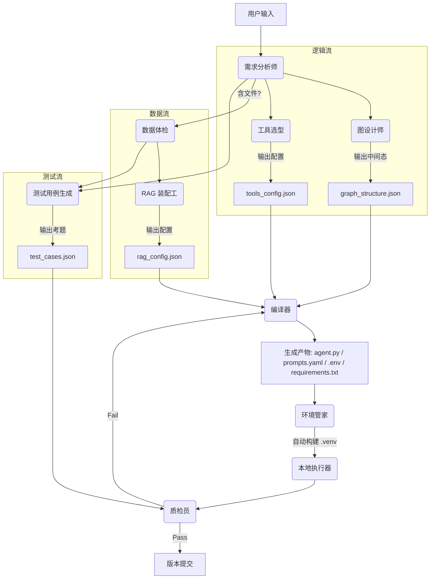

---

# 🚀 项目名称：Agent_Zero (零号特工) v6.0
**Slogan:** Define logic, generate graph, auto-deploy. (定义逻辑，生成图谱，自动部署)

## 一、 项目愿景 (Executive Summary)
打造一款**桌面端、本地化、全自动**的智能体构建工厂。
Agent_Zero 摒弃厚重的容器技术，通过**元编程 (Meta-Programming)** 将自然语言转化为 LangGraph 拓扑，并在**本地隔离环境**中完成代码生成、依赖安装、测试闭环与自我修复。

*   **核心理念**：
    1.  **Graph as Code**：引入 JSON 中间层 (IR)，解耦业务逻辑与代码实现。
    2.  **Environment Isolation**：无 Docker，使用原生 Python `venv` + `subprocess` 实现轻量级隔离。
    3.  **Proactive Evolution**：利用 **LangChain MCP** 协议，实现依赖库的主动重构与升级。
    4.  **Dual-Track API**：严格区分“构建用模型 (Builder)”与“运行用模型 (Runtime)”。

---

## 二、 核心技术架构 (System Architecture)

### 1. 双流生成引擎 (The Dual-Stream Engine)
系统采用并行流水线设计，最后汇聚于编译器。




---

### 🟢 阶段一：前置分析 (Analysis Phase)

#### 1. Node: PM (需求分析师)
*   **角色**: 整个系统的“大脑皮层”，负责理解意图。
*   **输入**:
    *   `user_query` (str): 用户输入的自然语言（如“帮我写个查股价的助手”）。
    *   `chat_history` (list): 多轮对话历史。
*   **核心逻辑**:
    *   调用 **Builder API** 。
    *   澄清需求：如果需求模糊，生成反问句；如果需求清晰，生成配置。
    *   **关键决策**: 判断是否需要 RAG（有无文件？），判断任务类型（聊天/搜索/分析）。
*   **输出**: `project_meta.json`
    ```json
    {
      "agent_name": "StockBot",
      "description": "查询股票并分析",
      "has_rag": false,
      "language": "zh-CN",
      "user_intent_summary": "..."
      ...
    }
    ```

---

### 🔵 阶段二：逻辑流 (Stream Logic)

#### 2. Node: Graph_Designer (图设计师)
*   **角色**: LangGraph 拓扑结构的设计者。
*   **输入**: `project_meta.json`
*   **核心逻辑**:
    *   调用 **Builder API**。
    *   **思维链 (CoT)**: 根据需求，决定需要几个节点（Node），节点间如何连接（Edge），是否存在条件判断（Conditional Edge）。
    *   **中间层生成**: 严格遵循预定义的 JSON Schema 生成中间表示 (IR)。
*   **输出**: `graph_structure.json`
    ```json
    {
      "nodes": [
        {"id": "agent", "type": "llm"},
        {"id": "action", "type": "tool"}
      ],
      "edges": [
        {"source": "action", "target": "agent"}
      ],
      "conditional_edges": [
        {"source": "agent", "condition": "should_continue", "branches": {"continue": "action", "end": "END"}}
      ]
    }
    ```
*   **开发建议**: 使用 `Pydantic` 定义 Schema，强制 LLM 输出合法的 JSON。

#### 3. Node: Tool_Selector (工具选型)
*   **角色**: 为 Agent 配备“双手”。
*   **输入**: `project_meta.json`
*   **核心逻辑**:
    *   加载内置工具库列表（Search, Calculator, FileWrite等）。
    *   语义匹配：根据用户意图，选择 Top-K 个合适的工具。
    *   **注意**: 必须区分“内置工具”和“自定义工具”（暂仅支持内置）。
*   **输出**: `tools_config.json`
    ```json
    {
      "enabled_tools": ["tavily_search_results_json", "llm_math_chain"]
    }
    ```

---

### 🟠 阶段三：数据流 (Stream Data)

#### 4. Node: Profiler (数据体检)
*   **角色**: 摸清数据底细，为 RAG 策略做依据。
*   **输入**: 用户上传的文件路径列表 `file_paths`。
*   **核心逻辑**:
    *   **本地运行** (不调 LLM)。
    *   使用 `unstructured` 或 `pymupdf` 读取文件。
    *   计算特征：
        *   `file_hash`: MD5值（用于增量更新）。
        *   `text_density`: 文本/图片比例。
        *   `structure_type`: 是否包含大量表格。
*   **输出**: `data_profile.json`

#### 5. Node: RAG_Builder (RAG 装配工)
*   **角色**: 定制检索策略。
*   **输入**: `data_profile.json`
*   **核心逻辑**:
    *   调用 **Builder API**。
    *   根据体检报告决策：
        *   表格多 -> 推荐 `ParentDocumentRetriever`。
        *   文件极大 -> 推荐 `chunk_size=2000` + `overlap=200`。
        *   普通文档 -> 推荐 `RecursiveCharacterTextSplitter`。
*   **输出**: `rag_config.json`
    ```json
    {
      "splitter": "recursive",
      "chunk_size": 1000,
      "k_retrieval": 5,
      "embedding_model": "openai" // 这里只是标记，实际运行时读 .env
    }
    ```

---

### 🟣 阶段四：测试流 (Stream Test)

#### 6. Node: Test_Gen (测试用例生成)
*   **角色**: 生成“高考试卷”。
*   **输入**: `project_meta.json` + `data_profile.json` (如有)。
*   **核心逻辑**:
    *   调用 **Builder API**。
    *   策略：
        *   **Fact-based**: 从 RAG 文档摘要中提取 3 个事实，生成 Q&A。
        *   **Logic-based**: 针对 Agent 功能生成 2 个边界测试（如“输入乱码怎么办”）。
*   **输出**: `test_cases.json`
    ```json
    [
      {"input": "财报里提到的净利润是多少？", "expected_keywords": ["500万", "增长"]},
      {"input": "你好", "expected_tone": "friendly"}
    ]
    ```

---

### ⚫ 阶段五：编译与环境 (Synthesis & Env)

#### 7. Node: Compiler (编译器)
*   **角色**: 将所有 JSON 缝合为可执行代码。
*   **输入**: `graph_structure.json`, `rag_config.json`, `tools_config.json`。
*   **核心逻辑**:
    *   **模板渲染**: 使用 `Jinja2` 加载 `agent_template.py.j2`。
    *   **Prompt 分离**: 提取所有 prompt 字符串，生成 `prompts.yaml`。
    *   **依赖锁定**: 根据用到的模块，生成 `requirements.txt` (版本锁死，如 `langchain==0.1.15`)。
    *   **配置生成**: 生成 `.env.template`。
*   **输出**:
    *   `/agents/{id}/agent.py`
    *   `/agents/{id}/prompts.yaml`
    *   `/agents/{id}/requirements.txt`

#### 8. Node: Env_Manager (环境管家)
*   **角色**: 基础设施建设。
*   **输入**: `requirements.txt`
*   **核心逻辑**:
    *   **去 Docker 化**: 使用 Python `subprocess`。
    *   检查是否存在 `.venv` 文件夹。
    *   若无，执行 `python -m venv .venv`。
    *   调用 `.venv/bin/pip install -r requirements.txt`。
    *   **优化**: 预先下载常用 whl 包到本地缓存目录，加速安装。
*   **输出**: 一个就绪的虚拟环境。

---

### 🔴 阶段六：执行与闭环 (Execution & Loop)

#### 9. Node: Runner (本地执行器)
*   **角色**: 在沙盒中跑代码。
*   **输入**: `agent.py`, `test_cases.json`。
*   **核心逻辑**:
    *   **环境注入**: 读取 **Runtime API Config** (用户设置的 Ollama 或 OpenAI Key)，临时注入环境变量。
    *   **子进程启动**: 使用 `.venv/bin/python agent.py` 运行。
    *   **安全限制**: 设置 `timeout=60s`，工作目录限制在 Agent 文件夹内。
    *   **捕获**: 获取 `stdout` (正常输出) 和 `stderr` (报错)。
*   **输出**: `execution_log.txt`, `run_result.json`

#### 10. Node: Judge (质检员)
*   **角色**: 判卷。
*   **输入**: `run_result.json`, `test_cases.json`, `stderr`。
*   **核心逻辑**:
    *   **Level 1 (Crash Check)**: 如果 `stderr` 有 Python Traceback，直接 FAIL。
    *   **Level 2 (Accuracy Check)**: 调用 **Builder API** 对比模型输出和标准答案。
    *   **Level 3 (Cost Check)**: 检查 Token 消耗是否异常。
*   **输出**:
    *   `status`: PASS / FAIL
    *   `feedback`: 具体的错误归因（是代码错了，还是 API 连不上？）。

#### 11. Feedback Loop (Compiler 回路)
*   **角色**: 自动修 Bug。
*   **输入**: `Judge.feedback`。
*   **核心逻辑**:
    *   如果反馈是“API Connection Error” -> **不修改代码**，提示用户检查网络。
    *   如果反馈是“ImportError” -> 调用 **MCP Client** 查文档 -> Compiler 修正依赖。
    *   如果反馈是“Answer Wrong” -> Compiler 调整 Prompt 或 RAG 参数。
    *   **熔断**: 最大重试 3 次。

#### 12. Node: Git_Commit (版本提交)
*   **角色**: 存档。
*   **核心逻辑**:
    *   `git init` (如果是首次)。
    *   `git add .`
    *   `git commit -m "Auto-generated v{n}"`。
    *   为后续的“一键回滚”提供支持。

---


### 2. 目录结构规范 (Standard Output)
每个 Agent 是一个独立的项目包，具备完整的工程化结构：
```text
/agents/my_agent_v1/
├── .venv/                 # [自动管理] 隔离的 Python 虚拟环境
├── .env                   # [配置] API Key 和 Base URL (Runtime用)
├── agent.py               # [源码] 主程序 (包含 Graph 定义)
├── graph.json             # [中间层] 图结构描述 (用于 UI 回显/编辑)
├── prompts.yaml           # [解耦] System Prompt 和 RAG 模板
├── requirements.txt       # [依赖] 版本锁定的依赖列表
├── chroma_db/             # [数据] 本地增量向量库
├── state.db               # [记忆] SQLite Checkpoint (断点续传用)
├── run.bat / run.sh       # [交付] 一键启动脚本
└── .git/                  # [版本] 本地版本控制
```

---

## 三、 关键功能模块详解

### 1. API 双轨制与堡垒 (Dual-Track API Fortress)
为了解决“造 Agent”和“用 Agent”的资源隔离问题，UI 设置分为两部分：

*   **Builder API (系统设置)**：
    *   **用途**：驱动 PM, Architect, Coder, Judge, MCP Client 思考。
    *   **要求**：也是由用户进行配置，**推荐是强模型** (GPT-4o / Claude 3.5 Sonnet)。
    *   **隔离**：配置存储在 Agent_Zero 系统加密区，**绝不**写入生成的 Agent 代码中。
*   **Runtime API (项目设置)**：
    *   **用途**：生成的 Agent 实际运行时调用。
    *   **要求**：由用户进行配置，丰俭由人。支持目前市面上所有的包括OpenAI, DeepSeek等, 或 **Local Ollama** 。
    *   **注入**：Env Manager 将此配置写入项目的 `.env` 文件。
*   **启动体检 (Pre-flight Check)**：
    *   软件启动检测 Builder API 连通性。
    *   Runner 启动前检测 Runtime API 连通性 (防止因 Ollama 没开服务而误报代码错误)。

### 2. 自动化环境隔离 (Auto-Venv)
*   **原理**：利用 Python 标准库 `venv`。
*   **流程**：
    1.  检查 `./agents/{id}/.venv`。
    2.  不存在则创建。
    3.  安装依赖：`pip install -r requirements.txt` (自动配置国内镜像源)。
    4.  **版本锁定**：生成的 `requirements.txt` 默认锁定版本 (如 `langchain==0.1.15`)，确保稳定性。

### 3. 基于 MCP 的主动重构 (Proactive Refactoring)
**这是解决“周更库”问题的终极方案。**
*   **触发**：用户点击“一键升级”或“检查更新”。
*   **流程**：
    1.  **Snapshot**：自动 `git tag pre_upgrade`。
    2.  **Consult**：Builder API 调用 **LangChain MCP 服务**，查询当前代码中使用的类是否过时，获取最新迁移指南。
    3.  **Refactor**：LLM 根据 MCP 的建议，**在不改变业务逻辑的前提下**，重写 Python 代码（现代化改造）。
    4.  **Upgrade**：更新 `requirements.txt` 到最新版并安装。
    5.  **Verify**：运行 `test_cases.json`。
    6.  **Rollback**：若测试失败，自动回退到 Git Tag。

### 4. 交互与运维 (Ops & UX)
*   **Prompt 分离**：所有提示词提取到 `prompts.yaml`，用户可手动微调，无需改代码。
*   **流式可视化**：通过 LangChain Callbacks 捕获运行步骤，UI 实时点亮流程图节点。
*   **中断与重续 (HITL)**：
    *   集成 `SqliteSaver`。
    *   支持 `interrupt_before` 断点。
    *   UI 提供“暂停 -> 修改 State -> 继续”的人工干预面板。
*   **成本熔断**：实时计算 Token 消耗，超过预算（如 $0.5）强制停止。

---

## 四、 开发实施路线图 (Roadmap)

我们将项目分为 4 个阶段，总计约 8-9 周。

### 阶段一：内核 MVP (The Kernel) - 2 周
**目标**：跑通“JSON -> 代码 -> Venv -> 运行”的死流程。
*   **Week 1**:
    *   定义 `graph_structure.json` Schema。
    *   开发 Compiler：实现 JSON 到 Python (Jinja2 模板) 的编译。
    *   开发 Env Manager：实现 `subprocess` 调用 venv 的脚本。
*   **Week 2**:
    *   实现 API 双轨配置 UI (Builder vs Runtime)。
    *   实现 Builder API 的连通性检测。
    *   联调：生成一个 Hello World Agent 并在本地 venv 跑通。

### 阶段二：数据流与工具 (Data & Tools) - 2 周
**目标**：赋予 Agent 复杂的业务能力。
*   **Week 3**:
    *   开发 Profiler & RAG Builder：集成 `Unstructured`，实现 ChromaDB 增量更新逻辑。
    *   Prompt 分离：实现 `prompts.yaml` 的生成与读取。
*   **Week 4**:
    *   集成 LangChain 工具箱 (Search, Math)。
    *   在 Graph JSON 中支持 `ToolNode` 的定义。

### 阶段三：闭环与进化 (The Loop & Evolution) - 3 周
**目标**：实现自动化测试与 MCP 更新。
*   **Week 5**:
    *   开发 Test Generator：基于数据生成 QA 对。
    *   开发 Runner & Judge：捕获 `stderr`，实现简单的自我修正循环。
*   **Week 6**:
    *   **核心攻坚**：集成 **LangChain MCP Client**。
    *   实现“主动重构 (Proactive Refactoring)”工作流。
*   **Week 7**:
    *   实现 Git 快照与回滚机制。

### 阶段四：产品化 (Production) - 2 周
**目标**：从工具变成商业软件。
*   **Week 8**:
    *   UI 升级：流式日志、动态图谱、成本监控面板。
    *   HITL：开发“中断/继续”交互功能。
*   **Week 9**:
    *   Exporter：一键打包 (.zip) 与 Dify YAML 导出。
    *   全链路测试与 Bug Bash。

---

## 五、 风险管理 (Risk Management)

| 风险点 | 严重级 | 应对策略 |
| :--- | :--- | :--- |
| **Builder 模型太弱** | 🔥🔥🔥 | 若用户在 Builder 设置里填了 Ollama 小模型，代码生成质量将崩溃。**对策**：UI 强提示推荐使用 GPT-4o；Compiler 增加 JSON 校验层，格式错误直接驳回。 |
| **MCP 服务不稳定** | 🔥🔥 | LangChain 官方文档源可能变动。**对策**：本地缓存一份核心迁移指南，MCP 连不上时使用兜底规则。 |
| **依赖安装地狱** | 🔥🔥 | Windows/Mac/Linux 路径差异。**对策**：所有路径处理使用 `os.path.join`；预置 `pip.ini` 强制使用清华/阿里源。 |
| **死循环烧钱** | 🔥 | **对策**：Builder 侧限制最大修正次数 (3次)；Runtime 侧设置 Token 熔断阈值。 |

