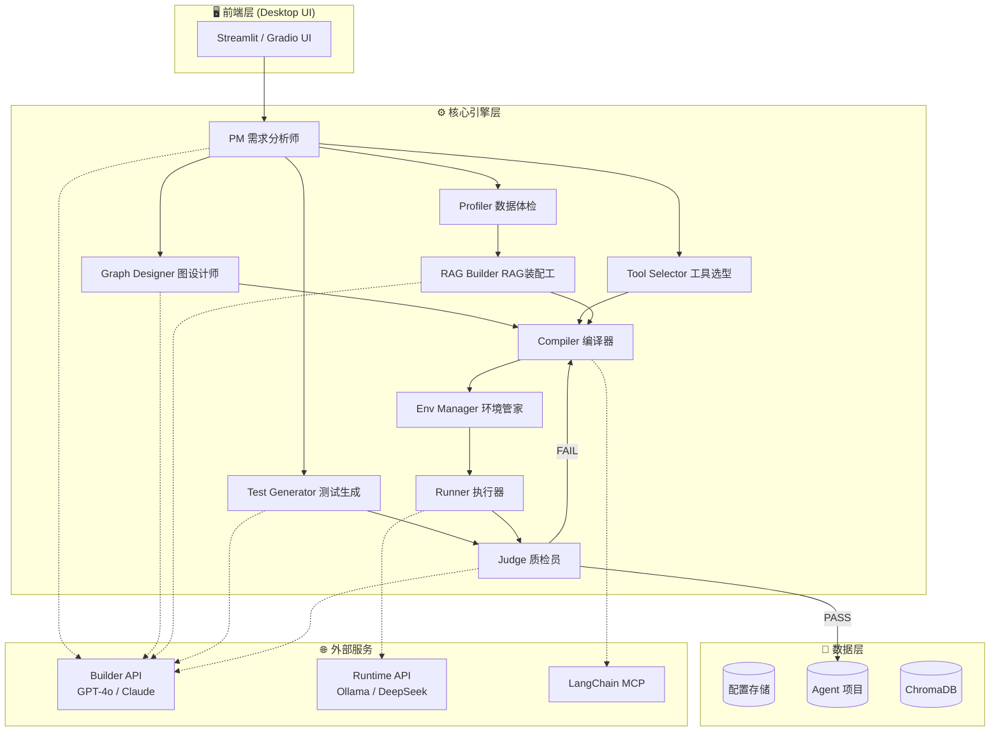
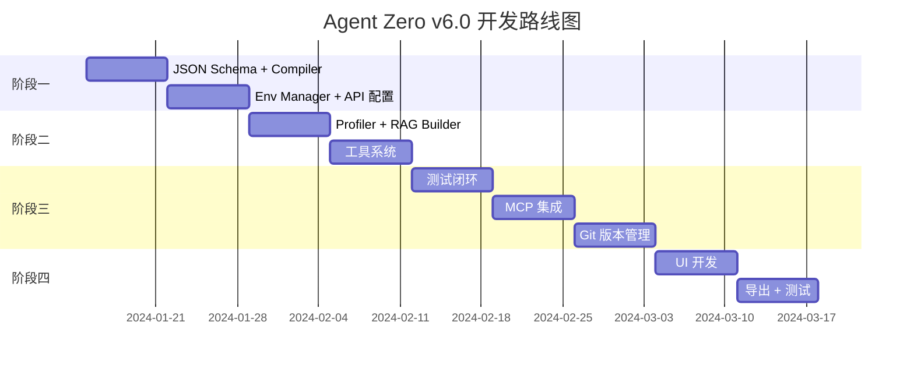

# Agent Zero v6.0 详细实施计划

> **项目愿景**: 打造一款桌面端、本地化、全自动的智能体构建工厂，通过元编程将自然语言转化为 LangGraph 拓扑。

---

## 🏗️ 系统架构设计

### 1. 整体架构图



### 2. 技术栈选型

| 层级 | 技术选型 | 版本建议 |
|:-----|:---------|:---------|
| **编程语言** | Python | 3.11+ |
| **LLM 框架** | LangChain + LangGraph | langchain>=0.2.0, langgraph>=0.1.0 |
| **向量数据库** | ChromaDB | chromadb>=0.4.22 |
| **文档解析** | Unstructured | unstructured>=0.12.0 |
| **模板引擎** | Jinja2 | jinja2>=3.1.2 |
| **数据校验** | Pydantic | pydantic>=2.5.0 |
| **UI 框架** | Streamlit | streamlit>=1.30.0 |
| **进程管理** | subprocess (标准库) | Python 内置 |
| **版本控制** | GitPython | gitpython>=3.1.40 |

---

## 📁 项目文件结构

```text
Agent_Zero/
├── 📂 src/                          # 源代码目录
│   ├── 📂 core/                     # 核心引擎
│   │   ├── __init__.py
│   │   ├── pm.py                    # PM 需求分析师
│   │   ├── graph_designer.py        # 图设计师
│   │   ├── tool_selector.py         # 工具选型
│   │   ├── profiler.py              # 数据体检
│   │   ├── rag_builder.py           # RAG 装配工
│   │   ├── test_generator.py        # 测试用例生成
│   │   ├── compiler.py              # 编译器
│   │   ├── env_manager.py           # 环境管家
│   │   ├── runner.py                # 本地执行器
│   │   └── judge.py                 # 质检员
│   │
│   ├── 📂 schemas/                  # Pydantic 数据模型
│   │   ├── __init__.py
│   │   ├── project_meta.py          # 项目元信息 Schema
│   │   ├── graph_structure.py       # 图结构 Schema
│   │   ├── rag_config.py            # RAG 配置 Schema
│   │   ├── tools_config.py          # 工具配置 Schema
│   │   ├── test_cases.py            # 测试用例 Schema
│   │   └── execution_result.py      # 执行结果 Schema
│   │
│   ├── 📂 templates/                # Jinja2 代码模板
│   │   ├── agent_template.py.j2     # Agent 主程序模板
│   │   ├── rag_template.py.j2       # RAG 模块模板
│   │   └── prompts_template.yaml.j2 # Prompt 配置模板
│   │
│   ├── 📂 tools/                    # 内置工具库
│   │   ├── __init__.py
│   │   ├── registry.py              # 工具注册表
│   │   ├── search.py                # 搜索工具
│   │   ├── calculator.py            # 计算工具
│   │   └── file_ops.py              # 文件操作工具
│   │
│   ├── 📂 llm/                      # LLM 客户端封装
│   │   ├── __init__.py
│   │   ├── builder_client.py        # Builder API 客户端
│   │   ├── runtime_client.py        # Runtime API 客户端
│   │   └── mcp_client.py            # MCP 客户端
│   │
│   ├── 📂 utils/                    # 工具函数
│   │   ├── __init__.py
│   │   ├── file_utils.py            # 文件操作
│   │   ├── git_utils.py             # Git 操作
│   │   └── validation.py            # 校验工具
│   │
│   └── 📂 ui/                       # UI 界面
│       ├── __init__.py
│       ├── app.py                   # Streamlit 主程序
│       ├── pages/                   # 页面组件
│       │   ├── builder.py           # 构建页面
│       │   ├── settings.py          # 设置页面
│       │   └── monitor.py           # 监控页面
│       └── components/              # UI 组件
│
├── 📂 agents/                       # 生成的 Agent 项目目录
│   └── [agent_id]/                  # 单个 Agent 项目
│
├── 📂 config/                       # 系统配置
│   ├── builder_api.yaml             # Builder API 配置
│   ├── runtime_api.yaml             # Runtime API 配置
│   └── tool_registry.yaml           # 工具注册表
│
├── 📂 tests/                        # 测试代码
│   ├── 📂 unit/                     # 单元测试
│   ├── 📂 integration/              # 集成测试
│   └── 📂 e2e/                      # 端到端测试
│
├── 📂 docs/                         # 文档
│   └── api/                         # API 文档
│
├── requirements.txt                 # 项目依赖
├── requirements-dev.txt             # 开发依赖
├── pyproject.toml                   # 项目配置
└── README.md                        # 项目说明
```

---

## 📐 核心数据结构定义 (Pydantic Schemas)

### 1. project_meta.py - 项目元信息

```python
from pydantic import BaseModel, Field
from typing import Optional, List
from enum import Enum

class TaskType(str, Enum):
    CHAT = "chat"
    SEARCH = "search"
    ANALYSIS = "analysis"
    RAG = "rag"
    CUSTOM = "custom"

class ProjectMeta(BaseModel):
    """PM 节点输出的项目元信息"""
    agent_name: str = Field(..., description="Agent 名称", min_length=1, max_length=50)
    description: str = Field(..., description="Agent 功能描述")
    has_rag: bool = Field(default=False, description="是否需要 RAG")
    task_type: TaskType = Field(default=TaskType.CHAT, description="任务类型")
    language: str = Field(default="zh-CN", description="主要语言")
    user_intent_summary: str = Field(..., description="用户意图摘要")
    file_paths: Optional[List[str]] = Field(default=None, description="用户上传的文件路径")
    clarification_needed: bool = Field(default=False, description="是否需要进一步澄清")
    clarification_questions: Optional[List[str]] = Field(default=None, description="澄清问题列表")
```

### 2. graph_structure.py - 图结构定义

```python
from pydantic import BaseModel, Field, model_validator
from typing import List, Dict, Optional, Literal

class NodeDef(BaseModel):
    """图节点定义"""
    id: str = Field(..., description="节点唯一标识")
    type: Literal["llm", "tool", "rag", "conditional", "custom"] = Field(..., description="节点类型")
    config: Optional[Dict] = Field(default=None, description="节点配置")

class EdgeDef(BaseModel):
    """普通边定义"""
    source: str = Field(..., description="源节点 ID")
    target: str = Field(..., description="目标节点 ID")

class ConditionalEdgeDef(BaseModel):
    """条件边定义"""
    source: str = Field(..., description="源节点 ID")
    condition: str = Field(..., description="条件函数名")
    branches: Dict[str, str] = Field(..., description="分支映射 {条件值: 目标节点}")

class GraphStructure(BaseModel):
    """完整的图结构定义"""
    nodes: List[NodeDef] = Field(..., min_length=1, description="节点列表")
    edges: List[EdgeDef] = Field(default_factory=list, description="普通边列表")
    conditional_edges: List[ConditionalEdgeDef] = Field(default_factory=list, description="条件边列表")
    entry_point: str = Field(default="agent", description="入口节点 ID")
    
    @model_validator(mode='after')
    def validate_graph(self):
        """验证图的完整性"""
        node_ids = {node.id for node in self.nodes}
        # 验证边的节点引用
        for edge in self.edges:
            if edge.source not in node_ids:
                raise ValueError(f"Edge source '{edge.source}' not found in nodes")
            if edge.target not in node_ids and edge.target != "END":
                raise ValueError(f"Edge target '{edge.target}' not found in nodes")
        return self
```

### 3. rag_config.py - RAG 配置

```python
from pydantic import BaseModel, Field
from typing import Literal, Optional

class RAGConfig(BaseModel):
    """RAG 配置"""
    splitter: Literal["recursive", "character", "token", "semantic"] = Field(
        default="recursive", description="分割器类型"
    )
    chunk_size: int = Field(default=1000, ge=100, le=4000, description="分块大小")
    chunk_overlap: int = Field(default=200, ge=0, le=500, description="分块重叠")
    k_retrieval: int = Field(default=5, ge=1, le=20, description="检索数量")
    embedding_model: str = Field(default="openai", description="嵌入模型标识")
    retriever_type: Literal["basic", "parent_document", "multi_query"] = Field(
        default="basic", description="检索器类型"
    )
    reranker_enabled: bool = Field(default=False, description="是否启用重排序")
```

### 4. tools_config.py - 工具配置

```python
from pydantic import BaseModel, Field
from typing import List

class ToolsConfig(BaseModel):
    """工具配置"""
    enabled_tools: List[str] = Field(
        default_factory=list, 
        description="启用的工具列表"
    )
```

### 5. test_cases.py - 测试用例

```python
from pydantic import BaseModel, Field
from typing import List, Optional
from enum import Enum

class TestType(str, Enum):
    FACT_BASED = "fact_based"
    LOGIC_BASED = "logic_based"
    BOUNDARY = "boundary"

class TestCase(BaseModel):
    """单个测试用例"""
    id: str = Field(..., description="测试用例 ID")
    type: TestType = Field(..., description="测试类型")
    input: str = Field(..., description="输入内容")
    expected_keywords: Optional[List[str]] = Field(default=None, description="期望包含的关键词")
    expected_tone: Optional[str] = Field(default=None, description="期望的语气")
    expected_not_contain: Optional[List[str]] = Field(default=None, description="不应包含的内容")
    timeout_seconds: int = Field(default=30, description="超时时间")

class TestSuite(BaseModel):
    """测试套件"""
    cases: List[TestCase] = Field(..., description="测试用例列表")
```

### 6. execution_result.py - 执行结果

```python
from pydantic import BaseModel, Field
from typing import Optional, List
from enum import Enum
from datetime import datetime

class ExecutionStatus(str, Enum):
    PASS = "pass"
    FAIL = "fail"
    ERROR = "error"
    TIMEOUT = "timeout"

class TestResult(BaseModel):
    """单个测试结果"""
    test_id: str
    status: ExecutionStatus
    actual_output: Optional[str] = None
    error_message: Optional[str] = None
    duration_ms: int
    token_usage: Optional[int] = None

class ExecutionResult(BaseModel):
    """完整执行结果"""
    overall_status: ExecutionStatus
    test_results: List[TestResult]
    stderr: Optional[str] = None
    feedback: Optional[str] = None
    total_token_usage: int = 0
    executed_at: datetime = Field(default_factory=datetime.now)
```

---

## 🔧 各模块详细开发任务

### 阶段一：内核 MVP (Week 1-2)

#### Week 1: 核心编译管道

##### Task 1.1: 定义 JSON Schema 体系
- **文件**: `src/schemas/*.py`
- **工作内容**:
  1. 实现上述所有 Pydantic 模型
  2. 添加 JSON Schema 导出功能
  3. 编写 Schema 单元测试

##### Task 1.2: 开发 Compiler 编译器
- **文件**: `src/core/compiler.py`
- **工作内容**:
  ```python
  class Compiler:
      def __init__(self, template_dir: Path):
          self.env = Environment(loader=FileSystemLoader(template_dir))
      
      def compile(
          self,
          graph: GraphStructure,
          rag_config: Optional[RAGConfig],
          tools_config: ToolsConfig,
          output_dir: Path
      ) -> CompileResult:
          """
          将 JSON 配置编译为可执行代码
          
          输出:
          - agent.py: 主程序
          - prompts.yaml: 提示词配置
          - requirements.txt: 依赖列表
          - .env.template: 环境变量模板
          """
          pass
  ```
- **关键点**:
  - Jinja2 模板设计（条件渲染、循环生成）
  - 依赖版本锁定策略
  - 代码格式化（使用 `black`）

##### Task 1.3: 开发 Env Manager 环境管家
- **文件**: `src/core/env_manager.py`
- **工作内容**:
  ```python
  class EnvManager:
      def __init__(self, agent_dir: Path):
          self.agent_dir = agent_dir
          self.venv_path = agent_dir / ".venv"
      
      async def setup_environment(self) -> bool:
          """创建虚拟环境并安装依赖"""
          pass
      
      def get_python_executable(self) -> Path:
          """获取 venv 中的 Python 路径"""
          pass
      
      async def install_requirements(self) -> bool:
          """安装 requirements.txt"""
          pass
  ```
- **关键点**:
  - 跨平台路径处理（`pathlib`）
  - pip 镜像源配置
  - 安装超时处理

#### Week 2: API 配置与联调

##### Task 1.4: 实现 API 双轨配置
- **文件**: `src/llm/builder_client.py`, `src/llm/runtime_client.py`
- **工作内容**:
  ```python
  class BuilderClient:
      """Builder API 客户端 - 用于构建时的 LLM 调用"""
      
      def __init__(self, config: BuilderAPIConfig):
          self.client = self._init_client(config)
      
      async def call(self, prompt: str, schema: Optional[Type[BaseModel]] = None) -> str:
          """调用 Builder API，可选结构化输出"""
          pass
      
      async def health_check(self) -> bool:
          """连通性检测"""
          pass
  ```
- **配置文件**: `config/builder_api.yaml`
  ```yaml
  provider: openai  # openai / anthropic / azure
  model: gpt-4o
  api_key: ${BUILDER_API_KEY}  # 从环境变量读取
  base_url: null  # 可选自定义端点
  timeout: 60
  max_retries: 3
  ```

##### Task 1.5: Hello World Agent 联调
- **验收标准**:
  1. 手动编写一个 `graph_structure.json`
  2. Compiler 生成 `agent.py`
  3. Env Manager 创建 venv 并安装依赖
  4. Agent 能在 venv 中正常运行

---

### 阶段二：数据流与工具 (Week 3-4)

#### Week 3: RAG 管道

##### Task 2.1: 开发 Profiler 数据体检
- **文件**: `src/core/profiler.py`
- **工作内容**:
  ```python
  class DataProfiler:
      """分析用户上传的文件特征"""
      
      def analyze(self, file_paths: List[Path]) -> DataProfile:
          """
          分析文件并返回特征报告
          
          输出:
          - file_hash: MD5 哈希
          - file_type: 文件类型
          - text_density: 文本密度
          - has_tables: 是否包含表格
          - estimated_tokens: 预估 token 数
          """
          pass
  ```
- **依赖**: `unstructured`, `python-magic`, `pymupdf`

##### Task 2.2: 开发 RAG Builder
- **文件**: `src/core/rag_builder.py`
- **工作内容**:
  ```python
  class RAGBuilder:
      """根据数据特征推荐 RAG 策略"""
      
      def __init__(self, llm_client: BuilderClient):
          self.llm = llm_client
      
      async def design_rag_strategy(self, profile: DataProfile) -> RAGConfig:
          """
          基于数据特征设计 RAG 策略
          
          决策逻辑:
          - 表格多 -> ParentDocumentRetriever
          - 文件极大 -> chunk_size=2000
          - 普通文档 -> RecursiveCharacterTextSplitter
          """
          pass
  ```

##### Task 2.3: Prompt 分离机制
- **模板文件**: `src/templates/prompts_template.yaml.j2`
  ```yaml
  system_prompt: |
    你是一个专业的 {{ agent_type }} 助手。
    {{ custom_instructions }}
  
  rag_prompt: |
    基于以下上下文回答问题:
    {context}
    
    问题: {question}
  
  tool_prompt: |
    你可以使用以下工具: {{ tools | join(', ') }}
  ```

#### Week 4: 工具系统

##### Task 2.4: 工具注册表
- **文件**: `src/tools/registry.py`
- **工作内容**:
  ```python
  class ToolRegistry:
      """工具注册与发现"""
      
      def __init__(self):
          self._tools: Dict[str, ToolDef] = {}
      
      def register(self, name: str, tool: BaseTool, description: str):
          """注册工具"""
          pass
      
      def get_tool(self, name: str) -> BaseTool:
          """获取工具实例"""
          pass
      
      def search(self, query: str, top_k: int = 5) -> List[ToolDef]:
          """语义搜索匹配工具"""
          pass
  ```
- **预置工具**:
  - `tavily_search`: 网络搜索
  - `llm_math`: 数学计算
  - `file_read`: 文件读取
  - `file_write`: 文件写入
  - `python_repl`: Python 执行

##### Task 2.5: Tool Selector 实现
- **文件**: `src/core/tool_selector.py`
- **工作内容**:
  ```python
  class ToolSelector:
      """根据需求选择合适的工具"""
      
      async def select_tools(
          self, 
          project_meta: ProjectMeta,
          registry: ToolRegistry
      ) -> ToolsConfig:
          """基于语义匹配选择工具"""
          pass
  ```

---

### 阶段三：闭环与进化 (Week 5-7)

#### Week 5: 测试与执行

##### Task 3.1: Test Generator 测试生成器
- **文件**: `src/core/test_generator.py`
- **工作内容**:
  ```python
  class TestGenerator:
      """自动生成测试用例"""
      
      async def generate(
          self,
          project_meta: ProjectMeta,
          data_profile: Optional[DataProfile]
      ) -> TestSuite:
          """
          生成测试套件
          
          策略:
          - Fact-based: 从 RAG 文档提取事实生成 Q&A
          - Logic-based: 针对功能生成边界测试
          - Boundary: 异常输入测试
          """
          pass
  ```

##### Task 3.2: Runner 本地执行器
- **文件**: `src/core/runner.py`
- **工作内容**:
  ```python
  class LocalRunner:
      """在沙盒环境中执行 Agent"""
      
      async def run_test(
          self,
          agent_dir: Path,
          test_case: TestCase,
          runtime_config: RuntimeAPIConfig
      ) -> TestResult:
          """
          执行单个测试
          
          流程:
          1. 注入 Runtime API 环境变量
          2. 子进程启动 agent.py
          3. 捕获 stdout/stderr
          4. 处理超时
          """
          pass
  ```

##### Task 3.3: Judge 质检员
- **文件**: `src/core/judge.py`
- **工作内容**:
  ```python
  class Judge:
      """评估执行结果"""
      
      async def evaluate(
          self,
          test_suite: TestSuite,
          results: List[TestResult]
      ) -> ExecutionResult:
          """
          三级评估:
          - Level 1: Crash Check (stderr 检查)
          - Level 2: Accuracy Check (关键词匹配)
          - Level 3: Cost Check (Token 消耗)
          """
          pass
      
      def generate_feedback(self, result: ExecutionResult) -> str:
          """生成修复建议"""
          pass
  ```

#### Week 6: MCP 集成

##### Task 3.4: MCP Client 实现
- **文件**: `src/llm/mcp_client.py`
- **工作内容**:
  ```python
  class MCPClient:
      """LangChain MCP 协议客户端"""
      
      async def query_migration_guide(
          self,
          deprecated_api: str
      ) -> Optional[MigrationGuide]:
          """查询 API 迁移指南"""
          pass
      
      async def get_latest_version(
          self,
          package: str
      ) -> str:
          """获取包的最新版本"""
          pass
  ```
- **兜底机制**: 本地缓存核心迁移规则

##### Task 3.5: 自动重构工作流
- **文件**: `src/core/refactor.py`
- **工作内容**:
  ```python
  class ProactiveRefactor:
      """主动重构模块"""
      
      async def upgrade_agent(self, agent_dir: Path) -> RefactorResult:
          """
          升级工作流:
          1. Git tag pre_upgrade
          2. 查询 MCP 获取迁移建议
          3. LLM 重写代码
          4. 更新依赖
          5. 运行测试
          6. 失败则回滚
          """
          pass
  ```

#### Week 7: Git 集成

##### Task 3.6: Git 版本管理
- **文件**: `src/utils/git_utils.py`
- **工作内容**:
  ```python
  class GitManager:
      """Git 版本控制管理"""
      
      def init_repo(self, agent_dir: Path) -> None:
          """初始化 Git 仓库"""
          pass
      
      def commit(self, agent_dir: Path, message: str) -> str:
          """提交变更，返回 commit hash"""
          pass
      
      def tag(self, agent_dir: Path, tag_name: str) -> None:
          """创建标签"""
          pass
      
      def rollback(self, agent_dir: Path, target: str) -> None:
          """回滚到指定版本"""
          pass
  ```

---

### 阶段四：产品化 (Week 8-9)

#### Week 8: UI 开发

##### Task 4.1: Streamlit 主界面
- **文件**: `src/ui/app.py`
- **页面结构**:
  1. **Builder 页面**: 输入需求 -> 生成 Agent
  2. **Settings 页面**: API 配置（Builder/Runtime）
  3. **Monitor 页面**: 运行监控、日志查看
  4. **Projects 页面**: Agent 项目管理

##### Task 4.2: 流式可视化
- **功能**:
  - 实时显示生成进度
  - Graph 拓扑可视化（使用 `pyvis`）
  - Token 消耗实时统计

##### Task 4.3: HITL 人工干预
- **功能**:
  - 暂停执行
  - 查看/修改中间状态
  - 手动跳过节点
  - 继续执行

#### Week 9: 导出与测试

##### Task 4.4: 一键导出
- **功能**:
  - ZIP 打包（包含 venv 配置说明）
  - Dify YAML 格式导出
  - 生成 README.md

##### Task 4.5: 全链路测试
- **测试类型**:
  - 单元测试：各模块独立测试
  - 集成测试：模块间协作测试
  - E2E 测试：完整流程测试

---

## ✅ 验证计划

### 自动化测试

| 测试类型 | 运行命令 | 覆盖范围 |
|:---------|:---------|:---------|
| 单元测试 | `pytest tests/unit/ -v` | Schema 校验、工具函数 |
| 集成测试 | `pytest tests/integration/ -v` | Compiler、Env Manager |
| E2E 测试 | `pytest tests/e2e/ -v --timeout=300` | 完整生成流程 |

### 阶段验收标准

| 阶段 | 验收标准 |
|:-----|:---------|
| Week 2 | 手写 JSON -> 编译 -> venv 运行 Hello World Agent |
| Week 4 | 上传 PDF -> 自动生成 RAG Agent -> 能回答文档问题 |
| Week 7 | 完整闭环：需求 -> 生成 -> 测试 -> 自动修复 -> 通过 |
| Week 9 | UI 完整可用，一键导出 ZIP 包 |

---

## 📊 里程碑总结



---

> [!TIP]
> **建议先从阶段一开始实施**，完成核心 MVP 后可以快速迭代。每个阶段结束时都应有可运行的交付物。
