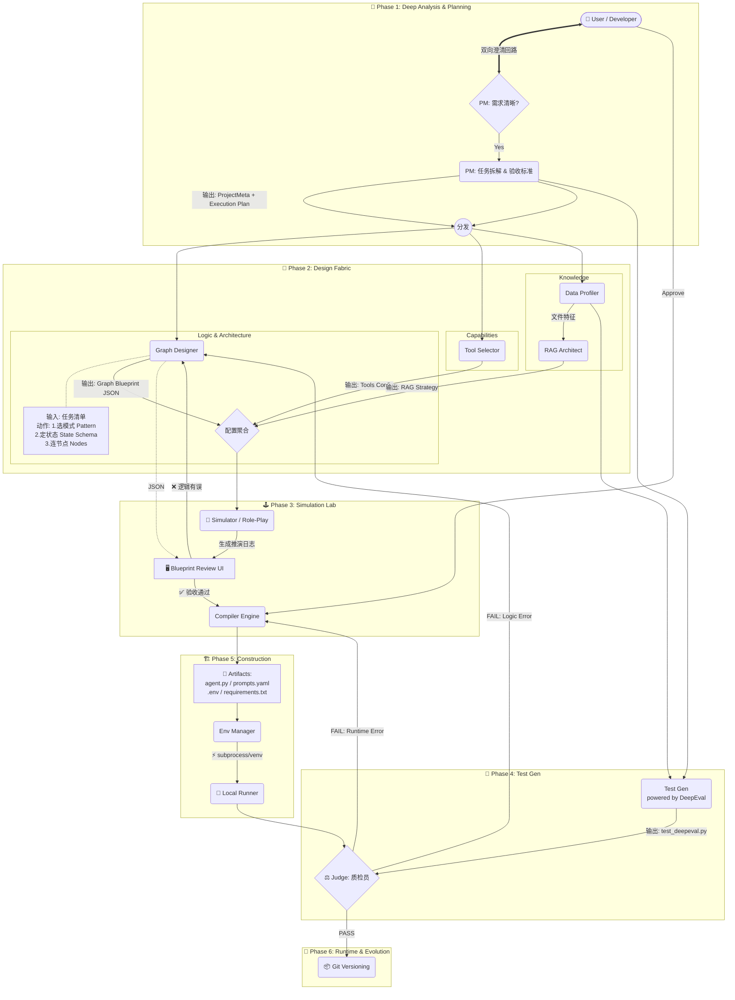

---

# 🚀 项目名称：Agent_Zero (零号特工) v6.0
**Slogan:** Define logic, simulate graph, auto-deploy. (定义逻辑，仿真图谱，自动部署)

## 一、 项目愿景 (Executive Summary)
打造一款**桌面端、本地化、全自动**的智能体构建工厂。
Agent_Zero 摒弃厚重的容器技术，通过**元编程 (Meta-Programming)** 将自然语言转化为 LangGraph 拓扑，并在**本地隔离环境**中完成代码生成、依赖安装、测试闭环与自我修复。

*   **核心理念**：
    1.  **Graph as Code**：引入 JSON 中间层 (IR)，解耦业务逻辑与代码实现。
    2.  **Blueprint Simulation**：编译前沙盘推演，低成本试错。
    3.  **Environment Isolation**：无 Docker，使用原生 Python `venv` + `subprocess` 实现轻量级隔离。
    4.  **Proactive Evolution**：利用 **LangChain MCP** 协议，实现依赖库的主动重构与升级。
    5.  **Dual-Track API**：严格区分"构建用模型 (Builder)"与"运行用模型 (Runtime)"。

---

## 二、 核心技术架构 (System Architecture)

### 1. 六阶段蓝图仿真引擎 (The Blueprint Simulation Engine)
系统采用"先仿真后编译"的设计理念，通过六个阶段将用户需求转化为可执行 Agent。



---

### 🟢 阶段一：深度分析与规划 (Deep Analysis & Planning)

#### 1. Node: PM (需求分析师) - 双脑模式

PM 采用**双脑模式**，分为澄清者(Clarifier)和规划者(Planner)两个子角色。

##### 1.1 PM Clarifier (澄清者)
*   **角色**: 需求的"守门人"，确保信息完整。
*   **输入**: `user_query` (str), `chat_history` (list)
*   **核心逻辑**:
    *   Check: 信息完整度 < 80% ?
    *   True → 生成 2-3 个关键反问句
    *   False → 放行到 Planner
*   **输出**: `status: "clarifying" | "ready"`, `clarification_questions: List[str]`

##### 1.2 PM Planner (规划者)
*   **角色**: 任务的"拆解大师"，生成结构化执行计划。
*   **输入**: 已验证的需求信息
*   **核心逻辑**:
    *   调用 **Builder API**
    *   生成分层任务清单 (Hierarchical Planning)
    *   评估任务复杂度
*   **输出**: `project_meta.json`
    ```json
    {
      "agent_name": "StockBot",
      "description": "查询股票并分析",
      "has_rag": false,
      "task_type": "analysis",
      "complexity_score": 6,
      "status": "ready",
      "execution_plan": [
        {"step": 1, "role": "Architect", "goal": "设计数据获取流程"},
        {"step": 2, "role": "Coder", "goal": "实现 API 调用"},
        {"step": 3, "role": "Tester", "goal": "验证数据准确性"}
      ]
    }
    ```

---

### 🔵 阶段二：并行设计流 (Design Fabric)

#### 2. Node: Graph_Designer (图设计师) - 三步设计法

这是 LangGraph 的灵魂。采用**"选型 → 定义 → 连接"**三步法。

##### 2.1 Step 1: Pattern Selection (模式选择)
*   **预置模式库**：
    | 模式 | 适用场景 | 结构 |
    |------|----------|------|
    | Sequential | 简单线性任务 | `A → B → C` |
    | Reflection | 写作/编程 | `Generate ↔ Critique` |
    | Supervisor | 多工具协作 | `Manager → [Workers] → Manager` |
    | Plan-Execute | 长流程任务 | `Planner → Executor → Replanner` |

##### 2.2 Step 2: State Schema Definition (状态定义)
*   明确**"节点之间传什么数据"**
*   **输出**: `state_schema`
    ```json
    "state_schema": {
      "messages": "List[BaseMessage]",
      "code_draft": "str",
      "review_comments": "str",
      "retry_count": "int",
      "is_finished": "bool"
    }
    ```

##### 2.3 Step 3: Nodes & Edges (节点与边)
*   **条件边增强**: 支持 `condition_logic` 表达式
    ```json
    "conditional_edges": [
      {
        "source": "reviewer",
        "condition": "should_retry",
        "condition_logic": "if retry_count < 3 and 'error' in review_comments: return 'coder'; else: return 'end'",
        "branches": {"coder": "coder_node", "end": "END"}
      }
    ]
    ```

#### 3. Node: Tool_Selector (工具选型)
*   **角色**: 为 Agent 配备"双手"。
*   **核心逻辑**: 语义匹配 + 任务类型规则
*   **预置工具**: `calculator`, `file_read`, `file_write`, `python_repl`, `tavily_search`

---

### 🟠 阶段二续：数据流 (Data Stream)

#### 4. Node: Profiler (数据体检)
*   **角色**: 摸清数据底细，为 RAG 策略做依据。
*   **输入**: 用户上传的文件路径列表
*   **核心逻辑**: 本地运行，计算 MD5、文本密度、表格检测、Token 估算
*   **输出**: `data_profile.json`

#### 5. Node: RAG_Builder (RAG 装配工)
*   **角色**: 定制检索策略。
*   **决策规则**:
    | 条件 | 分割器 | Chunk Size | 检索器 |
    |------|--------|------------|--------|
    | 表格多 | semantic | 1000-1500 | parent_document |
    | 大文件 (>100k) | token | 2000 | multi_query |
    | 普通文档 | recursive | 1000 | basic |
*   **输出**: `rag_config.json`

---

### 🟡 阶段三：沙盘推演 (Simulation Lab) [核心新增]

#### 6. Node: Simulator (沙盘推演)
*   **角色**: 在编译前进行逻辑验证，是防止架构崩塌的**关键防火墙**。
*   **输入**: `graph_structure.json` + `sample_input`
*   **核心逻辑**:
    *   LLM 扮演 Simulator，按图结构模拟运行
    *   不生成代码，不调用 API
    *   检测死循环、unreachable 节点等问题
*   **输出**: `simulation_log.txt`
    > "我是 Simulator。当前进入 'Coder' 节点。模拟生成了代码... 状态更新：code_draft='import...'。进入 'Reviewer' 节点。模拟发现 Bug... 触发条件 retry_count < 3。决定跳回 'Coder' 节点。"

#### 7. Blueprint Review UI
*   **功能**: 可视化展示图结构 + 推演轨迹
*   **交互**: 用户可直接修改 JSON，此时**还没生成一行代码**，修改成本极低

---

### 🟣 阶段四：测试流 (Test Stream) [DeepEval 驱动]
 
 #### 8. Node: Test_Gen (测试用例生成)
 *   **框架**: 集成 **DeepEval** 专业评估框架
 *   **策略**:
     *   **RAG Testing**: 使用 `Faithfulness` 和 `ContextualRecall` 指标（基于 Fact）
     *   **Logic Testing**: 使用 `G-Eval` 和 `AnswerRelevancy` 验证业务逻辑
 *   **机制**: 配合 **外部 Trace 存储**，将检索的大型文档与状态分离，仅将元数据传递给 Judge。
 *   **输出**: `tests/test_deepeval.py`

---

### ⚫ 阶段五：编译与环境 (Construction)

#### 9. Node: Compiler (编译器)
*   **角色**: 将所有 JSON 缝合为可执行代码。
*   **核心逻辑**:
    *   **模板渲染**: Jinja2 模板
    *   **TypedDict 生成**: 根据 `state_schema` 自动生成
    *   **条件函数生成**: 根据 `condition_logic` 生成 Python 函数
*   **输出**: `agent.py`, `prompts.yaml`, `requirements.txt`, `.env.template`

#### 10. Node: Env_Manager (环境管家)
*   **角色**: 基础设施建设。
*   **核心逻辑**: `python -m venv .venv` + `pip install -r requirements.txt`

---

### 🔴 阶段六：运行时闭环 (Runtime & Evolution)

#### 11. Node: Runner (本地执行器)
*   **角色**: 在沙盒中跑代码。
*   **核心逻辑**: 环境注入 + 子进程启动 + 超时控制

#### 12. Node: Judge (质检员) - 双重反馈
*   **角色**: 判卷 + 错误分类。
*   **核心逻辑**:
    *   **Level 1 (Crash Check)**: stderr 有 Traceback → FAIL
    *   **Level 2 (Accuracy Check)**: 对比标准答案
    *   **Level 3 (Cost Check)**: Token 消耗检查
*   **双重反馈机制**:
    | 错误类型 | 反馈目标 | 示例 |
    |----------|----------|------|
    | Runtime Error | Compiler | ImportError, SyntaxError |
    | Logic Error | Graph_Designer | 死循环, 答案持续错误 |

#### 13. Node: Git_Commit (版本提交)
*   **角色**: 存档，支持一键回滚。

---

## 三、 目录结构规范 (Standard Output)

每个 Agent 是一个独立的项目包：
```text
/agents/my_agent_v1/
├── .venv/                 # [自动管理] 隔离的 Python 虚拟环境
├── .env                   # [配置] API Key 和 Base URL (Runtime用)
├── agent.py               # [源码] 主程序 (包含 Graph 定义)
├── graph.json             # [中间层] 图结构描述 (用于 UI 回显/编辑)
├── prompts.yaml           # [解耦] System Prompt 和 RAG 模板
├── requirements.txt       # [依赖] 版本锁定的依赖列表
├── chroma_db/             # [数据] 本地增量向量库
├── simulation_log.txt     # [仿真] 推演日志
├── run.bat / run.sh       # [交付] 一键启动脚本
└── .git/                  # [版本] 本地版本控制
```

---

## 四、 关键功能模块详解

### 1. API 双轨制与堡垒 (Dual-Track API Fortress)
*   **Builder API (系统设置)**: 驱动 PM, Graph Designer, Simulator, Judge 思考。推荐强模型 (GPT-4o / DeepSeek)。
*   **Runtime API (项目设置)**: 生成的 Agent 实际运行时调用。支持 Ollama 本地模型。

### 2. 模式模板库 (Pattern Templates)
预置 4 种经典模式，降低设计门槛：
*   **Sequential**: 简单顺序执行
*   **Reflection**: 生成-批评循环
*   **Supervisor**: 主管调度多 Worker
*   **Plan-Execute**: 规划-执行-重规划

### 3. 沙盘推演机制 (Simulation)
*   **目的**: 在编写代码前发现架构问题
*   **方法**: LLM 角色扮演，文本模拟执行
*   **收益**: 减少 80%+ 的调试成本

### 4. 双重反馈回路 (Dual Feedback Loop)
*   **Runtime Error → Compiler**: 修代码
*   **Logic Error → Graph_Designer**: 改图结构

---

## 五、 开发实施路线图 (Roadmap)

### 阶段一：内核 MVP (Week 1-2) ✅ 已完成
*   Compiler, EnvManager, BuilderClient, RuntimeClient
*   基础模板系统
*   Hello World Agent 验证

### 阶段二：数据流与工具 (Week 3-4) ✅ 已完成
*   Profiler, RAG Builder
*   Tool Registry, Tool Selector
*   PM 基础实现, Graph Designer 基础实现

### 阶段三：蓝图仿真系统 (Week 5-6) 🔄 进行中
*   PM 双脑模式升级
*   Graph Designer 三步设计法
*   Simulator 沙盘推演
*   Blueprint Review 机制

### 阶段四：闭环与进化 (Week 7-8)
*   **DeepEval 测试框架集成** (Fact-based / Logic-based / G-Eval)
*   **Trace 外部存储架构** (解决 Context Window 爆炸)
*   Runner & Judge 自动化闭环
*   Git 版本与进化管理

### 阶段五：产品化 (Week 9-10)
*   UI 升级 (流式日志、动态图谱)
*   HITL 人工干预
*   Exporter (ZIP / Dify YAML)

---

## 六、 风险管理 (Risk Management)

| 风险点 | 严重级 | 应对策略 |
| :--- | :--- | :--- |
| **Simulator 推演不准确** | 🔥🔥 | 使用强模型 + 详细 Prompt；保留人工验收环节 |
| **模式模板过于僵化** | 🔥 | 支持 CUSTOM 模式，允许完全自定义 |
| **Builder 模型太弱** | 🔥🔥🔥 | UI 强提示推荐使用 GPT-4o；Compiler 增加 JSON 校验层 |
| **死循环检测失败** | 🔥🔥 | 强制在 State 中添加 retry_count；设置最大迭代次数 |
| **依赖安装地狱** | 🔥🔥 | 跨平台路径处理；预置镜像源配置 |

