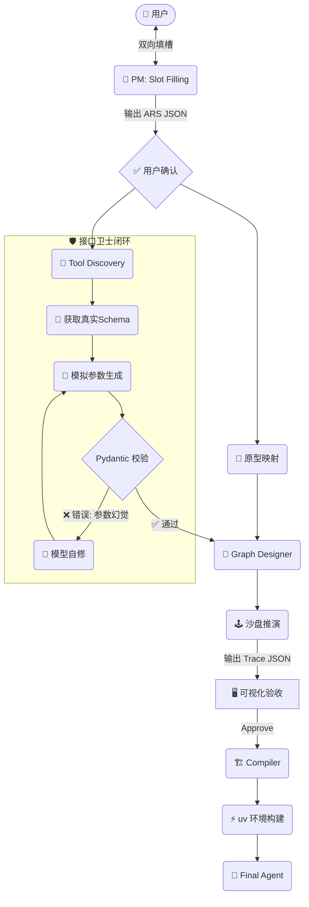

---

# 🚀 Agent_Zero 架构升级计划书 (v8.0)
**核心主旨**: 从“基于对话的生成器”进化为**“基于规格的自动化软件工厂”**。

## 一、 核心变革摘要 (Executive Summary)

本次升级旨在解决 Agent_Zero 当前面临的三大瓶颈：
1.  **需求模糊**: 模型听不懂“隐含需求”，导致设计偏差。 -> **解决方案: ARS 规格表**
2.  **工具幻觉**: 模型瞎编参数，导致运行时崩溃。 -> **解决方案: 接口卫士 (Interface Guard)**
3.  **构建迟缓**: 依赖安装太慢，工具列表僵化。 -> **解决方案: uv 集成 + 动态工具发现**

---

## 二、 模块一：PM 智能重构 —— 规格驱动 (Spec-Driven)

PM 不再是一个简单的聊天机器人，而是一个严谨的“需求架构师”。

### 1. 核心交付物：Agent_Requirement_Spec (ARS)
PM 必须填满这张 JSON 表才能进入下一阶段。它是整个系统的“法律契约”。

```json
{
  "meta": { "version": "1.0", "request_id": "req_001" },
  
  // [身份]: 决定 System Prompt
  "profile": {
    "name": "TravelAssistant",
    "role": "差旅预订专员",
    "tone": "专业、高效"
  },

  // [接口]: 决定 Runner 的 I/O 逻辑
  "interface": {
    "input_modality": ["text"], 
    "conversation_mode": "multi_turn" // 决定是否挂载 Memory 模块
  },

  // [能力]: 决定 Tool Discovery 搜什么
  "capabilities": {
    "core_task": "查询并预订机票",
    "tools_needed": ["flight_search_api", "calculator"],
    "knowledge_base": ["company_travel_policy.pdf"]
  },

  // [约束]: 决定架构模式与边界
  "constraints": {
    "budget_model": "cost_effective",   // 选模型策略
    "human_intervention": "required_for_booking", // 必须包含 HITL 节点
    "privacy": "no_cloud_upload"        // 只能用本地工具
  },

  // [验收]: 生成测试用例的依据
  "acceptance_criteria": [
    "必须校验日期格式为 YYYY-MM-DD",
    "未授权情况下不得调用支付接口"
  ]
}
```

### 2. 交互逻辑：Slot Filling (槽位填充)
PM 的状态机从“线性问答”改为“填槽循环”：
1.  **Listen**: 接收用户输入。
2.  **Analyze**: 提取信息填入 ARS。
3.  **Gap Analysis**: 检查 `constraints`, `interface` 等关键字段是否为空。
4.  **Ask**: 仅针对缺失字段追问（例如：“您没提是否需要人工确认，请问直接扣款还是先给您看一眼？”）。
5.  **Confirm**: 弹出 UI 卡片，用户确认 ARS 无误后，**锁定**该 JSON。

---

## 三、 模块二：动态工具体系 —— 拒绝幻觉 (No-Hallucination)

解决“不知道用什么工具”和“乱传参数”的问题。

### 1. 动态发现：Tool Discovery Engine
废弃静态工具列表，让 Agent 像逛超市一样选择工具。

*   **输入**: ARS 中的 `capabilities.core_task` (如 "订机票")。
*   **动作**:
    1.  **Search**: 在 Tool Hub / Vector DB 中检索。
    2.  **Select**: 比如找到 `Skyscanner_API` 和 `Mock_Flight_API`。
    3.  **Decision**: 根据 `constraints` (如“无 API Key”) 自动选择 `Mock_Flight_API`。
    4.  **Fetch Spec**: **抓取真实的 OpenAPI/JSON Schema**。

### 2. 接口卫士：Interface Guard (核心防火墙)
在 Compiler 生成代码前，强制校验工具调用逻辑。

*   **位置**: `Designer` -> **[Interface Guard]** -> `Compiler`
*   **工作流**:
    1.  **加载真值**: 读取工具的真实签名 (Signature)。
    2.  **试运行**: 让 Builder 模型尝试生成调用参数。
    3.  **强校验**: 使用 Pydantic V2 比对。
        *   *Error*: "Field 'max_results' not found. Did you mean 'limit'?"
    4.  **自动修复 (Self-Correction)**: 将错误回传给模型，模型修正参数直到通过校验。
*   **收益**: 100% 杜绝因参数名错误导致的 Runtime Crash。

---

## 四、 模块三：系统级效能优化 (Infrastructure Optimization)

### 1. 构建加速：集成 `uv`
*   **痛点**: `pip` 慢，`venv` 管理麻烦。
*   **方案**: 全面替换为 Astral 的 **`uv`**。
*   **命令变更**:
    *   `python -m venv` -> `uv venv`
    *   `pip install -r requirements.txt` -> `uv pip install -r requirements.txt`
*   **效果**: 环境准备时间从 **60s 降至 2s** (基于缓存)。

### 2. 架构翻译：Archetype Mapping (原型映射)
填补 ARS 到 Graph 代码之间的鸿沟。在 Designer 前增加映射层：

| ARS 约束条件 | 自动推荐 Pattern | 解释 |
| :--- | :--- | :--- |
| `human_intervention: required` | **Human-in-the-loop** | 插入中断/审核节点 |
| `reliability: high` | **Reflection / Self-Correction** | 增加结果检查节点 |
| `task: complex_breakdown` | **Plan-and-Execute** | 拆分为 Planner+Worker |
| `conversation: chat` | **Standard Chat w/ Memory** | 挂载 Checkpointer |

### 3. 可视化调试：Structured Trace
Simulator 不再只输出文本日志，必须输出 **Trace JSON**。
```json
{
  "trace": [
    {"step": 1, "node": "Tool_Hunter", "action": "find_tool", "result": "success"},
    {"step": 2, "node": "Interface_Guard", "action": "validate", "result": "failed", "error": "wrong_param"}
  ]
}
```
UI 层读取此 JSON 绘制动态进度条和错误红点。

---

## 五、 升级后的全链路工作流 (The New Workflow)



---

## 六、 实施路线图 (Action Plan)

### Phase 1: 基础重构 (Week 1)
*   [ ] **PM**: 编写 ARS JSON Schema 定义，重写 PM Prompt 实现填槽逻辑。
*   [ ] **Infra**: 集成 `uv`，重写 `EnvManager` 类。

### Phase 2: 工具体系升级 (Week 2)
*   [ ] **Core**: 实现 `Tool_Discovery` 节点，对接 3-5 个基础 API 的 OpenAPI 文档。
*   [ ] **Guard**: 实现基于 Pydantic 的 `Interface_Guard` 校验逻辑与重试回路。

### Phase 3: 串联与映射 (Week 3)
*   [ ] **Logic**: 实现 `Archetype Mapping` 规则表。
*   [ ] **Trace**: 改造 Simulator 输出格式为 JSON。
*   [ ] **UI**: 制作 "ARS 确认卡片" 和 "构建错误可视化" 界面。

这一版计划书将你的构想落地为可执行的工程方案，既保证了 Agent 的**智能性**（动态发现），又通过**规则约束**（ARS & Interface Guard）保证了工程的**稳定性**。